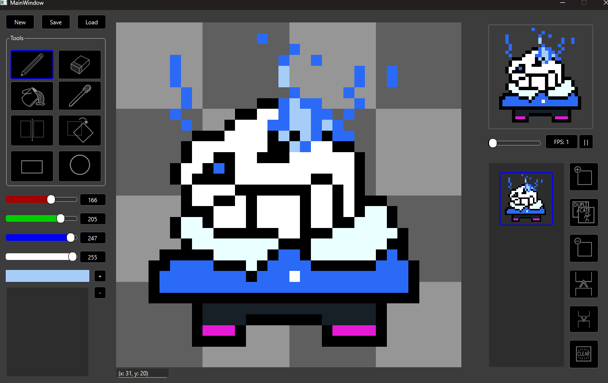

# Sprite Editor 

A lightweight, feature-rich **sprite creation and animation tool** built in **C++ with Qt**.  
The editor provides a complete set of drawing tools, color palette management, animation controls, and project saving/loading — designed for artists and developers who want a responsive, pixel-perfect workflow.

---

## Features

### Drawing Tools
- **Pen Tool** – precise pixel-by-pixel drawing  
- **Eraser** – remove pixels or clean edges  
- **Paint Bucket** – fill contiguous areas with a selected color  
- **Eyedropper** – quickly sample colors from the canvas  
- **Mirror Mode** – draw symmetrically along an axis  
- **Flip Tool** – flip sprites horizontally or vertically  
- **Shape Tools** – draw **circles** and **rectangles** with adjustable sizes  

### Palette Editor
- Create and manage multiple custom **palettes**  
- Add, edit, and remove colors with **RGBA** value sliders  
- Save and reuse palettes across projects for consistent color design  

### Animation System
- Add, duplicate, delete, and reorder **frames** easily  
- **Clear frames** or create variations from existing ones  
- View full animation playback in a dedicated **Animation Window**  
- Adjust **frames per second (FPS)** in real time for smooth previews  

### Save & Load
- **Save** your entire sprite project (including all frames and palette data) to a file  
- **Load** previously saved projects to continue editing or animating later
 
---

## Tech Stack
- **Language:** C++  
- **Framework:** Qt 6 (Qt Creator)  
- **Libraries:** Qt Widgets / GUI
- **Design:** Object-oriented architecture for tools, palettes, and frame systems  
- **Version Control:** Git / GitHub

---

## Screenshot

### Main Editor

---

## Build & Run

> **Prereqs:** Qt (with qmake or CMake), and a C++17 compiler

1. **Clone**: `git clone https://github.com/Nzaffos/Sprite-Editor>.git`
2. **Open** the `.pro` project in **Qt Creator**.
3. **Configure** your kit (Desktop Qt).
4. **Build & Run** Use directly within the Qt window
